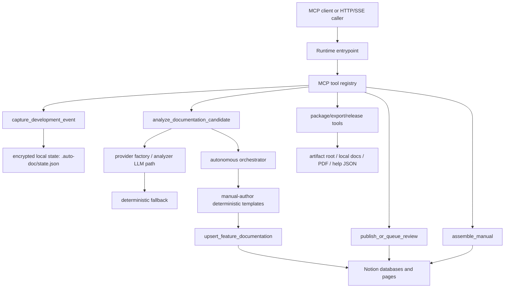
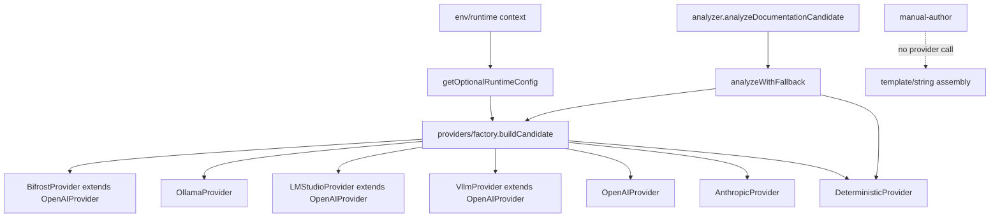
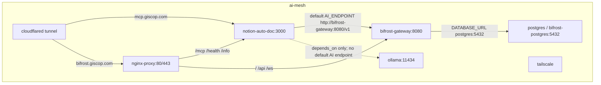

# Auto-Documentation MCP Server Architecture

Generated: 2026-06-14T00:00:00-04:00

Commit inspected: `457207c8930ead529fec7ffe9543492cc149d34d` with an uncommitted working tree. This document maps the checkout as inspected, including unstaged files that are currently present in the workspace.

## Bottom Line

Manual authoring does **not** invoke the LLM provider. The provider path is used during analysis only: `src/lib/analyzer.ts:227` calls `analyzeWithFallback`, and the result includes `generatedNarratives` at `src/lib/analyzer.ts:261`. The registered analysis tool then removes `generatedNarratives` before returning the tool response at `src/tools/analyze-documentation-candidate.ts:204`, and the autonomous orchestrator calls `authorManualSection` without passing any provider narrative at `src/orchestrator/auto-doc-orchestrator.ts:224`.

The authoring module itself imports filesystem helpers and redaction only, reads source files, extracts scripts/env vars with regexes, and assembles fixed User/Admin/Developer templates at `src/lib/manual-author.ts:1`, `src/lib/manual-author.ts:60`, `src/lib/manual-author.ts:99`, `src/lib/manual-author.ts:132`, `src/lib/manual-author.ts:177`, and `src/lib/manual-author.ts:238`. That is the primary reason the manuals look templated.

The live self-documentation run also explicitly configured the deterministic provider: `functional-tests/self-doc-1781478147909.run-log.json:13`. Its analyzer confidence reasons record `Provider used: deterministic` at `functional-tests/self-doc-1781478147909.run-log.json:77`, and the emitted manual text includes `Source context` plus the bad ``bash\nnpm ci`` startup command at `functional-tests/self-doc-1781478147909.run-log.json:1923`.

## System Data Flow

The key provider break is between `Analyze` and `Author`: analysis can call a provider, but manual prose authoring does not.

## Runtime Modes

| Mode | Entry point | Launch | Actual behavior |
|---|---|---|---|
| stdio MCP | `src/index.ts:45` | `node build/src/index.js` or `npm run dev` | Creates `McpServer`, attaches `StdioServerTransport`, and logs stdio readiness at `src/index.ts:45` and `src/index.ts:48`. |
| runner | `src/index.ts:35` | `AUTO_DOC_RUNTIME_MODE=runner node build/src/index.js` or arg `runner` | Dispatches to `runContinuousDocumentationRunner` at `src/index.ts:35`. |
| post-commit | `src/index.ts:40` | `node build/src/index.js post-commit` | Dispatches to git post-commit trigger at `src/index.ts:40`. |
| HTTP/SSE bridge | `src/cli/index.ts:11` | `node build/src/cli/index.js bridge` | CLI routes `bridge` to `runBridgeCommand`; Docker uses the same command at `Dockerfile:20` and `docker-compose.yml:76`. |
| setup CLI | `src/cli/index.ts:8` | `node build/src/cli/index.js setup` | Runs setup wizard. |

Discrepancy: `README.md:56` says `node build/src/cli/index.js runner` is valid, but the CLI switch only accepts `setup`, `bridge`, and `help` at `src/cli/index.ts:7`.

## Tool Registry

`createServer` constructs the MCP server at `src/server.ts:48` and registers tools at `src/server.ts:54`. `REGISTERED_TOOL_NAMES` is declared at `src/server.ts:20`.

| Tool | Registration evidence | Status | Purpose |
|---|---|---|---|
| `initialize_project_manual` | `src/server.ts:21`, `src/server.ts:54` | real | Create Notion project/database structure. |
| `capture_development_event` | `src/server.ts:22`, `src/server.ts:55` | real | Persist development evidence. |
| `analyze_documentation_candidate` | `src/server.ts:23`, `src/server.ts:56` | real but provider output is not used for authoring | Classify manual-worthiness and feature identity. |
| `upsert_feature_documentation` | `src/server.ts:24`, `src/server.ts:57` | real | Write/update feature and manual entry pages. |
| `publish_or_queue_review` | `src/server.ts:25`, `src/server.ts:58` | real | Publish or queue entries based on confidence/policy. |
| `package_manual` | `src/server.ts:26`, `src/server.ts:59` | real | Create release/manual package output. |
| `get_documentation_status` | `src/server.ts:27`, `src/server.ts:60` | real | Report project/manual status. |
| `get_git_diff_summary` | `src/server.ts:28`, `src/server.ts:61` | real | Summarize local git changes. |
| runner metadata/status tools | `src/server.ts:29`, `src/tools/extra-tools.ts:25` | real | Surface runner health/failure/release automation metadata. |
| `run_autonomous_documentation_trigger` | `src/server.ts:33`, `src/tools/extra-tools.ts:29` | real | Capture/analyze/upsert/publish pipeline. |
| visual tools | `src/server.ts:34`, `src/server.ts:35`, `src/server.ts:62`, `src/server.ts:63` | real | Attach visual evidence and capture screenshots. |
| `assemble_manual` | `src/server.ts:36`, `src/tools/extra-tools.ts:19` | real but deterministic assembly | Create User/Admin manual pages from published entries. |
| `configure_ai_provider` | `src/server.ts:37`, `src/tools/extra-tools.ts:20` | real | Set runtime provider config and optionally persist `.env`. |
| export/help-center tools | `src/server.ts:38`, `src/server.ts:39`, `src/server.ts:40`, `src/tools/extra-tools.ts:21` | real | Export Markdown/PDF/help-center JSON. |
| PR/release/local-sync tools | `src/server.ts:41`, `src/server.ts:44`, `src/server.ts:45`, `src/tools/extra-tools.ts:23` | real | Generate/publish PR comments, release docs, sync local docs. |

## Core Pipeline

The autonomous trigger creates an in-memory host and registers capture/analyze/upsert/publish tools at `src/orchestrator/auto-doc-orchestrator.ts:291`. It captures evidence at `src/orchestrator/auto-doc-orchestrator.ts:299`, analyzes it at `src/orchestrator/auto-doc-orchestrator.ts:301`, checks duplicate feature ids at `src/orchestrator/auto-doc-orchestrator.ts:310`, builds manual entries at `src/orchestrator/auto-doc-orchestrator.ts:347`, upserts them at `src/orchestrator/auto-doc-orchestrator.ts:341`, and publishes or queues review at `src/orchestrator/auto-doc-orchestrator.ts:361`.

Manual entries are generated by `buildManualEntries`; for each entry type it calls `authorManualSection` at `src/orchestrator/auto-doc-orchestrator.ts:224`. The current call passes `audience`, `entryType`, `featureName`, `summary`, `diffSummary`, `filesChanged`, and `repoPath`, but it does not pass `analysis.generatedNarratives` or any provider client at `src/orchestrator/auto-doc-orchestrator.ts:224`.

The release pipeline registers its required tools at `src/tools/run-release-documentation-pipeline.ts:67`, runs autonomous capture for a release at `src/tools/run-release-documentation-pipeline.ts:86`, assembles manuals at `src/tools/run-release-documentation-pipeline.ts:101`, packages them at `src/tools/run-release-documentation-pipeline.ts:105`, exports PDF at `src/tools/run-release-documentation-pipeline.ts:113`, syncs local docs at `src/tools/run-release-documentation-pipeline.ts:120`, exports help center JSON conditionally at `src/tools/run-release-documentation-pipeline.ts:127`, and optionally posts a PR comment at `src/tools/run-release-documentation-pipeline.ts:136`.

## Manual Authoring Reality

`manual-author.ts` reads default source candidates (`README.md`, `package.json`, `.env.example`, `Dockerfile`, `docker-compose.yml`) plus changed files at `src/lib/manual-author.ts:41` and `src/lib/manual-author.ts:66`. It truncates each file to 4,000 characters at `src/lib/manual-author.ts:81`. It extracts package scripts by regex at `src/lib/manual-author.ts:87`, env-like tokens by regex at `src/lib/manual-author.ts:99`, and the first backticked command containing node/npm/pnpm/yarn/docker at `src/lib/manual-author.ts:105`.

The `Source context:` wording is deterministic: `forbiddenEvidenceWords` replaces `Repo evidence excerpt:` with `Source context:` at `src/lib/manual-author.ts:128`, and the source text is appended into the authored body through `sourceText` at `src/lib/manual-author.ts:240`.

The wrong startup command is explained by `findCommand`: it selects the first backticked command containing `npm`/`node`/`docker` from the concatenated source at `src/lib/manual-author.ts:105`; README's first code block is `npm ci` at `README.md:15`, so the selected startup command can become the fenced `bash\nnpm ci` content seen in the live run at `functional-tests/self-doc-1781478147909.run-log.json:1923`.

## Manual Assembly

`assemble_manual` queries published manual entries from Notion at `src/tools/assemble-manual.ts:137`, extracts existing block content at `src/tools/assemble-manual.ts:158`, composes one User Manual and one Admin Manual at `src/tools/assemble-manual.ts:264`, and upserts the pages at `src/tools/assemble-manual.ts:273` and `src/tools/assemble-manual.ts:288`.

The assembler groups entry bodies into fixed sections using heading regexes and keyword matching at `src/lib/manual-assembler.ts:104` and `src/lib/manual-assembler.ts:63`. It adds default section text for overview/prerequisites/setup/expected-results/troubleshooting at `src/lib/manual-assembler.ts:132`, then emits a table of contents and section blocks at `src/lib/manual-assembler.ts:186`.

## Provider Chain

Provider types are routed in `src/providers/factory.ts:31`: `local-ollama` constructs `OllamaProvider` at `src/providers/factory.ts:34`, `local-lmstudio` constructs `LMStudioProvider` at `src/providers/factory.ts:36`, `local-vllm` constructs `VllmProvider` at `src/providers/factory.ts:38`, cloud OpenAI-compatible types construct `OpenAIProvider` at `src/providers/factory.ts:42`, `bifrost` constructs `BifrostProvider` at `src/providers/factory.ts:47`, and unknown types return the deterministic fallback at `src/providers/factory.ts:49`.

The prior local-provider misrouting is fixed in this checkout: local Ollama/LM Studio/vLLM no longer route to Bifrost according to `src/providers/factory.ts:34`.

`getProvider` health-checks the candidate at `src/providers/factory.ts:60`; if health-check fails, it returns deterministic fallback at `src/providers/factory.ts:62`. That health-check fallback is silent. If a healthy provider later throws during analysis, `analyzeWithFallback` logs a warning at `src/providers/factory.ts:81` and returns deterministic analysis at `src/providers/factory.ts:90`.

There is no distinct `OpenRouterProvider` class in `src/providers`. OpenRouter appears only as endpoint/key config: `OPENROUTER_ENDPOINT` and `OPENROUTER_API_KEY` are read into `cloudFallbackEndpoint` and `cloudFallbackApiKey` at `src/config.ts:147`, but `analyzeWithFallback` does not construct a secondary OpenRouter provider; it falls back to deterministic at `src/providers/factory.ts:90`. OpenRouter key can also be used as the primary OpenAI-compatible API key through `src/config.ts:141`, but only if `AI_ENDPOINT` and `AI_PROVIDER_TYPE` select that path.

Provider prompt input is thin structured evidence. `buildSharedPromptContent` includes branch, commit, PR title, first 20 files, extracted routes/endpoints/env vars, test status, and a 2,000-character diff summary at `src/providers/base.ts:51`. It does not feed the real source file bodies to the model.

## Configuration Resolution

`dotenv` is loaded at `src/config.ts:4`. Runtime context overrides are merged over env-derived config at `src/lib/runtime-context.ts:42`. Provider defaults are `AI_PROVIDER_TYPE=bifrost`, `AI_ENDPOINT=http://bifrost-gateway:8080/v1`, `AI_MODEL_NAME=openai/llama3.2:3b-instruct-q4_K_M`, and deterministic fallback enabled at `src/config.ts:139`, `src/config.ts:140`, `src/config.ts:142`, and `src/config.ts:152`.

`.env.example` mirrors these provider defaults at `.env.example:16`, `.env.example:17`, `.env.example:19`, and `.env.example:27`. Compose injects the same provider defaults into `notion-auto-doc` at `docker-compose.yml:61`.

To use direct local Ollama from inside Docker, the app would need `AI_PROVIDER_TYPE=local-ollama` and `AI_ENDPOINT=http://ollama:11434`. The Ollama container exists as service/container `ollama`, publishes `11434:11434`, and joins `ai-mesh` at `docker-compose.yml:22`, `docker-compose.yml:26`, and `docker-compose.yml:43`. The default app config does not set that URL; it points to `bifrost-gateway:8080/v1` at `docker-compose.yml:62`.

## Docker Topology

| Service | Image/build | Ports | Networks | Env/secrets | Volumes | Depends on | Status |
|---|---|---|---|---|---|---|---|
| `postgres` | `postgres:16-alpine` at `docker-compose.yml:4` | internal 5432 | `ai-mesh` at `docker-compose.yml:13` | `POSTGRES_*` at `docker-compose.yml:7` | `postgres-data` at `docker-compose.yml:11` | none | real, self-hosted profile |
| `ollama` | `ollama/ollama:latest` at `docker-compose.yml:23` | `11434:11434` at `docker-compose.yml:26` | `ai-mesh` at `docker-compose.yml:43` | Ollama tuning vars at `docker-compose.yml:30` | `ollama-models` at `docker-compose.yml:28` | none | real container, not the default app endpoint |
| `notion-auto-doc` | local Dockerfile build at `docker-compose.yml:48` | `3000:3000` at `docker-compose.yml:53` | `ai-mesh` at `docker-compose.yml:77` | Notion, bridge, AI, webhook, encryption env at `docker-compose.yml:55` | none | `ollama` at `docker-compose.yml:79` | real app; default command bridge at `docker-compose.yml:76` |
| `bifrost-gateway` | `maximhq/bifrost:v1.5.6` at `docker-compose.yml:89` | `8080:8080` at `docker-compose.yml:92` | `ai-mesh` at `docker-compose.yml:111` | Bifrost/session/db env at `docker-compose.yml:98` | config/data mounts at `docker-compose.yml:94` | postgres healthy and app healthy at `docker-compose.yml:113` | real gateway; route config unverified/empty |
| `cloudflared` | `cloudflare/cloudflared:latest` at `docker-compose.yml:121` | tunnel only | `ai-mesh` at `docker-compose.yml:132` | tunnel env at `docker-compose.yml:127` | `./cloudflared` at `docker-compose.yml:125` | `bifrost-gateway` at `docker-compose.yml:134` | real tunnel config |
| `tailscale` | `tailscale/tailscale:latest` at `docker-compose.yml:139` | none published | `ai-mesh` at `docker-compose.yml:153` | `TS_AUTHKEY`, routes at `docker-compose.yml:143` | state and `/dev/net/tun` at `docker-compose.yml:147` | none | real private network sidecar |
| `nginx` | `nginx:alpine` at `docker-compose.yml:158` | `80:80`, `443:443` at `docker-compose.yml:161` | `ai-mesh` at `docker-compose.yml:166` | none | nginx conf at `docker-compose.yml:164` | Bifrost and app at `docker-compose.yml:168` | real reverse proxy |

Bifrost routing to Ollama is not proven by checked-in config. `bifrost-config.json` contains only a schema key at `bifrost-config.json:1`, while the gateway mounts that file as both `/app/config.json` and `/app/data/config.json` at `docker-compose.yml:96`. Because no provider/model routes are visible in the repo config, whether Bifrost can actually reach Ollama is unverified by static reading.

## Security And State

Production-like mode requires a non-placeholder `STATE_ENCRYPTION_KEY`: `assertProductionSecretConfig` treats `NODE_ENV=production`, runtime `runner`, or runtime `bridge` as production-like at `src/config.ts:110` and throws when the key is missing or placeholder at `src/config.ts:118`. Compose enforces a required `STATE_ENCRYPTION_KEY` at `docker-compose.yml:75`.

Local state defaults to `.auto-doc/state.json` at `src/lib/state-store.ts:216`. Mutations are serialized through `mutate` at `src/lib/state-store.ts:289`; saves happen through `save` at `src/lib/state-store.ts:270`. Generated artifacts are constrained under `AUTO_DOC_ARTIFACT_ROOT` via `resolveArtifactPath` at `src/lib/artifact-paths.ts:23`.

HTTP bridge webhook ingestion rejects missing/invalid GitHub HMAC secrets at `src/http-bridge/server.ts:1163` and `src/http-bridge/server.ts:1174`, and AI-session webhooks at `src/http-bridge/server.ts:1262` and `src/http-bridge/server.ts:1273`. Screenshot capture blocks localhost/private/metadata targets at `src/lib/screenshots.ts:35` and throws `SCREENSHOT_TARGET_FORBIDDEN` at `src/lib/screenshots.ts:66`. Secret redaction covers named secret values, secret headers, and bearer tokens at `src/lib/redaction.ts:1`, `src/lib/redaction.ts:4`, and `src/lib/redaction.ts:5`.

## Feature Identity And Dedupe

Feature keys are route-first. `createFeatureKey` returns `route:<slug>` when a route is present at `src/analysis/feature-key.ts:8`, otherwise `<module>:<feature>` at `src/analysis/feature-key.ts:13`. Analyzer route inference checks route-ish file paths and summary text at `src/lib/analyzer.ts:74`.

Existing route-key collisions are treated as matched existing features at `src/lib/analyzer.ts:196`. Embedding-based fuzzy dedupe only runs when `EMBEDDING_PROVIDER` is not `none` at `src/lib/analyzer.ts:238`; `.env.example` sets `EMBEDDING_PROVIDER=none` at `.env.example:36`. The live self-doc verification confirms topic collapse: 12 evidence events became 6 feature pages at `functional-tests/self-doc-1781478147909.part2-verification.md:5`.

## Discrepancies And Gaps

| Severity | Claim/expectation | Reality | Evidence |
|---|---|---|---|
| high | Local LLM/OpenRouter is the brain for manual authoring. | Provider is only used by analyzer; manual authoring is deterministic templates and source regexes. | `src/lib/analyzer.ts:227`, `src/orchestrator/auto-doc-orchestrator.ts:224`, `src/lib/manual-author.ts:238` |
| high | OpenRouter is a fallback brain. | OpenRouter endpoint/key are config fields, but provider fallback returns deterministic, not OpenRouter. | `src/config.ts:147`, `src/providers/factory.ts:90` |
| high | Compose wires app directly to local Ollama brain. | Ollama exists and shares network, but app default endpoint is Bifrost; Bifrost route config is not present in checked-in config. | `docker-compose.yml:22`, `docker-compose.yml:62`, `bifrost-config.json:1` |
| medium | `node build/src/cli/index.js runner` starts runner mode. | CLI does not implement `runner`; runner mode is selected in `src/index.ts`. | `README.md:56`, `src/cli/index.ts:7`, `src/index.ts:35` |
| medium | Analysis generated narratives influence manual prose. | Registered analysis tool strips `generatedNarratives`, and orchestrator does not pass them to authoring. | `src/tools/analyze-documentation-candidate.ts:204`, `src/orchestrator/auto-doc-orchestrator.ts:224` |
| medium | VS Code companion is absent/disputed. | VS Code extension exists in this checkout. | `packages/vscode-extension/src/extension.ts:9`, `packages/vscode-extension/package.json:2` |
| medium | Runtime logs clearly indicate health-check fallback. | Provider analyze failure logs fallback, but candidate health-check failure returns deterministic without a warning. | `src/providers/factory.ts:61`, `src/providers/factory.ts:81` |

## Provider Failure Modes

| Mode | Decided at | Outcome | Detection |
|---|---|---|---|
| Unknown provider type | `src/providers/factory.ts:49` | Deterministic provider | Check `AI_PROVIDER_TYPE` and providerUsed reasons. |
| Candidate health-check fails | `src/providers/factory.ts:61` | Silent deterministic fallback | Add runtime telemetry; current code does not log this branch. |
| Provider analyze throws | `src/providers/factory.ts:76` | Warn and deterministic fallback if enabled | Logs `provider_factory` fallback at `src/providers/factory.ts:81`. |
| `AI_FALLBACK_TO_DETERMINISTIC=false` | `src/providers/factory.ts:77` | Throw provider error | Tool returns analyzer failure path. |
| OpenRouter expected as fallback | `src/config.ts:147` | Config is read but not invoked as fallback | Static check of factory fallback path. |
| Manual authoring path | `src/lib/manual-author.ts:238` | Always template/string assembly | Code import/call graph; no provider call site. |

## Functional Evidence

The self-doc proof created real Notion pages and exports, but output quality was partial. The verification report says the run initialized Notion, captured/analyzed/upserted documentation, assembled User/Admin pages, packaged a release, and exported Markdown/PDF/help-center artifacts, but 12 evidence events produced 6 feature pages and 12 manual entries at `functional-tests/self-doc-1781478147909.part2-verification.md:5`. User/Admin manual pages are recorded at `functional-tests/self-doc-1781478147909.verification.json:108` and `functional-tests/self-doc-1781478147909.verification.json:119`. The caveat is explicit at `functional-tests/self-doc-1781478147909.part2-verification.md:32`.

## Shared Context For Next Agents

Both Codex and Copilot should start from these assumptions:

- The product pipeline is real: runtime entrypoints, tool registration, autonomous orchestration, Notion persistence, assembly, release packaging, and exports exist.
- Manual body authoring is deterministic and does not call the LLM.
- Analyzer can call providers, but its generated narratives are stripped before the autonomous orchestrator can use them.
- The live self-doc run used deterministic provider configuration, not the local Docker LLM or OpenRouter.
- Docker includes Ollama, Bifrost, nginx, cloudflared, tailscale, and the app, but the checked-in config does not prove Bifrost routes to Ollama.
- OpenRouter is not implemented as an automatic fallback provider.
- Feature collapse is mostly route/key/dedupe behavior, and fuzzy embedding dedupe is disabled by default.

## Recommended Next Fix Sequence

1. Decide whether authoring should call a provider directly or consume analyzer-generated narratives.
2. Preserve/generated `generatedNarratives` through `analyze_documentation_candidate` and `executeAutonomousDocumentationTrigger`, or add a dedicated provider-backed authoring call.
3. Add provider-used telemetry for both analysis and authoring, including the silent health-check fallback branch.
4. Implement an actual OpenRouter/cloud fallback chain if that is a product requirement.
5. Fix Docker provider defaults so direct local Ollama uses `http://ollama:11434`, or add real Bifrost route config proving Bifrost reaches Ollama.
6. Feed real source/context into the authoring LLM, not only a truncated diff summary.
7. Replace regex-based command/env scraping with structured package/env/compose parsing.
8. Rework feature identity so independent product topics do not collapse into route/general keys.
