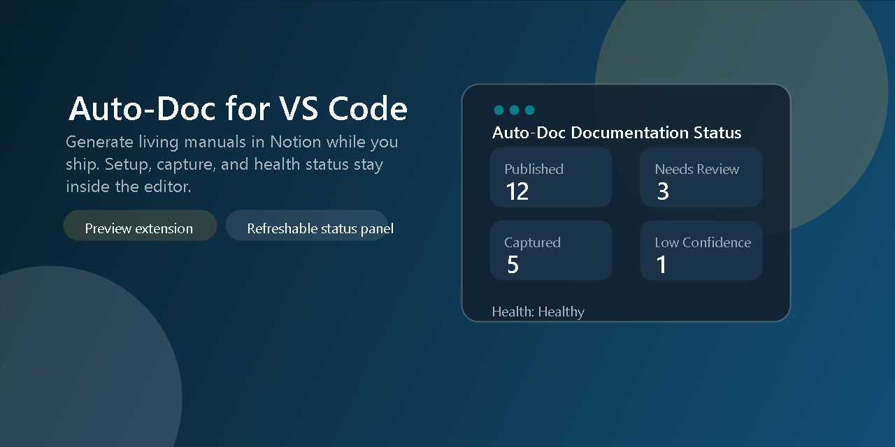

# Auto-Doc VS Code Extension (Phase 1)

This package contains the first vertical slice of the Auto-Doc VS Code extension:



- Activation and setup command wiring
- Secure token storage through VS Code SecretStorage
- Bundled MCP server launcher over stdio JSON-RPC
- Config writer for Cursor, Windsurf, and workspace .mcp.json
- Status panel with refreshable documentation health details

## Commands

- `Auto-Doc: Run Setup Wizard`
- `Auto-Doc: Capture Current Git State`
- `Auto-Doc: Open Notion Manual`
- `Auto-Doc: View Documentation Status`

## Current Capabilities

- Starts the bundled MCP server with the stored Notion token
- Calls `initialize_project_manual`, `capture_development_event`, and `get_documentation_status`
- Shows documentation health in a dedicated VS Code webview with refresh support
- Writes local MCP config for supported editors during setup

## Marketplace Readiness Notes

- This extension is still marked as preview while command surface and packaging metadata are being finalized.
- Repository, homepage, and issue tracker metadata point to the main project repository.
- The package now includes a shipped gallery icon and banner color, but `publisher` remains `local-dev` until a real Marketplace publisher ID is available.
- A lightweight Marketplace banner image is bundled in `assets/marketplace-banner.png` for README/gallery presentation.

## Preview


## Local Build

Run from repository root:

```powershell
npm run build
npm run build:extension
```

## Local VSIX Package

```powershell
npm run package:extension
```

## Local Install Smoke Test

```powershell
npm run smoke:extension-install
```
